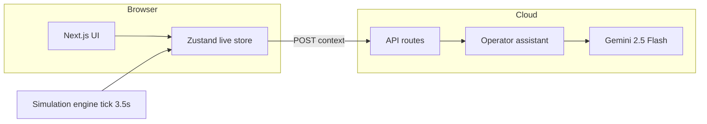

# StadiumOS AI

**Real-time stadium command intelligence for cricket at scale**

**Suryanshu Nabheet** · GDG Hackathon × Google Developer Groups  
**Venue:** Narendra Modi Stadium, Motera, Ahmedabad — IPL-scale night match (132,000 capacity)  
**Live:** [https://stadiumos-1060302697447.europe-west1.run.app/](https://stadiumos-1060302697447.europe-west1.run.app/)  
**License:** MIT · **Stack:** Next.js 16, Gemini 2.5 Flash, Google Cloud Run

---

## Overview

StadiumOS AI is an integrated operations platform for large cricket venues — one live view of crowd, security, and emergencies.

- Built for **GDG Hackathon**
- Co-brand: StadiumOS AI × Google Developer Groups
- Deployed on **Google Cloud Run** (europe-west1)

---

## The problem

### The threat

Massive crowds at cricket matches create **dangerous bottlenecks**, **severe security vulnerabilities**, and **logistical chaos** during highly congested **pre- and post-match** movements.

### The gap

Current stadium operations rely on **fragmented, manual systems**, leaving security and volunteers **unable to adapt instantly** to:

- Rapid **crowd surges**
- Unpredictable **weather** shifts
- **Emerging threats**

### The need

Organizers urgently need an **integrated, real-time command platform** to:

- Unify **ticketing** context with operations
- **Dynamically route** crowd flow
- **Automate emergency** responses

…for a **safe and seamless** fan experience.

Radios, spreadsheets, and siloed tools do not share one picture — by the time someone reacts, a gate can already be overloaded or an incident escalated.

---

## Our solution

**StadiumOS AI** = one **live telemetry stream** powering six operator workspaces plus a **Gemini assistant** that reads the same data.

| Pillar | What we deliver |
|--------|-----------------|
| **See** | Command center + circular digital twin |
| **Predict** | Crowd physics — gates, heatmap, stress index |
| **Act** | Emergency dispatch, reroutes, agent feed |
| **Ask** | Natural-language operator assistant |

Operators get a single command view with AI that cites **live numbers** from the same feed as the dashboards — not a disconnected chatbot.

---

## Architecture



**Data flow:** Browser simulation updates gates, stands, and incidents → every panel and the assistant use the **same snapshot**.

One store updates on a fixed interval; the assistant receives the same structured context as the dashboards.

---

## Platform walkthrough

**[Open the live app](https://stadiumos-1060302697447.europe-west1.run.app/)**

### Landing

- GDG branding, problem statement, MIT license
- **Open command center** to enter the platform

### Command center — `/dashboard`

- **KPIs** — occupancy, gate wait, incidents, throughput (live values)
- **Stadium map** — gates, routes, incidents, heatmap
- **Emergency alerts** and **traffic** sidebar
- **Crowd stress** and **AI confidence** indicators

Match control for Motera — 132,000 seats — wired to one live simulation.

### Crowd flow — `/crowd-flow`

- Heatmap grid and congestion chart
- **Gate pressure** — 8 ingress points with wait times
- **AI reroute** suggestions when gates cross thresholds

### Emergency — `/emergency`

- **Incident report** — structured brief copied to clipboard
- **Dispatch** — workflow: detected → dispatching → responding
- Response teams: **EMS Unit** (medical), **Rapid Response Squad** (crowd), **K9 & EOD Cell** (security / suspicious activity)

### Digital twin — `/twin`

- Circular stadium schematic — stands, pitch, floodlights
- Live density % per sector

### AI assistant — `/assistant`

- Grounded on live telemetry via **Gemini 2.5 Flash**
- Intent-aware replies (e.g. short greeting vs. operational answers)
- Example: *Which gate is overloaded?* → cites current gate name and load from the feed

### Analytics — `/analytics`

- Trends, throughput, evacuation readiness, AI confidence

**Health endpoint:** [https://stadiumos-1060302697447.europe-west1.run.app/api/health](https://stadiumos-1060302697447.europe-west1.run.app/api/health)

---

## Technology

| Layer | Choice |
|-------|--------|
| Frontend | Next.js 16, React 19, Tailwind 4, shadcn UI |
| State | Zustand (live simulation) |
| Charts | Recharts |
| AI | Google Gemini 2.5 Flash |
| Deploy | Docker → Cloud Run (europe-west1) |
| CI/CD | Cloud Build from GitHub |

```bash
curl https://stadiumos-1060302697447.europe-west1.run.app/api/health
```

---

## What makes StadiumOS different

1. **End-to-end product** — command center, crowd, emergency, twin, analytics, and assistant together
2. **Physics-linked simulation** — wait time and throughput correlate with gate density
3. **Motera-faithful twin** — circular ground, stand names, 8 gates
4. **Grounded assistant** — structured context and intent-aware responses
5. **Production deployment** — live URL on Google Cloud Run

---

## Scope and roadmap

**Current scope**

- High-fidelity live simulation (Motera layout and physics)
- Full operator UI and Gemini-powered assistant
- Production deploy on Cloud Run

**Next steps for production**

- Real sensor, CCTV, and ticketing API integration
- Role-based access for stadium operators
- PDF incident reports and audit logs

---

## Module links

| Module | URL |
|--------|-----|
| Landing | https://stadiumos-1060302697447.europe-west1.run.app/ |
| Command center | https://stadiumos-1060302697447.europe-west1.run.app/dashboard |
| Crowd flow | https://stadiumos-1060302697447.europe-west1.run.app/crowd-flow |
| Emergency | https://stadiumos-1060302697447.europe-west1.run.app/emergency |
| Digital twin | https://stadiumos-1060302697447.europe-west1.run.app/twin |
| Analytics | https://stadiumos-1060302697447.europe-west1.run.app/analytics |
| AI Assistant | https://stadiumos-1060302697447.europe-west1.run.app/assistant |

---

## FAQ

**Is the data real?**  
Live **simulation** with realistic physics and Motera layout. The architecture is built to consume real APIs through the same store and endpoints.

**How is this different from a dashboard plus ChatGPT?**  
One shared telemetry model across all modules; the assistant gets structured context and intent limits; dispatch, map, and reroutes are **actions** in the product, not chat-only.

**What does dispatch do?**  
Advances incident workflow and timeline; represents teams such as **Gujarat EMS**, **Rapid Response Squad**, and **K9 & EOD Cell**.

**What is EOD?**  
Explosive Ordnance Disposal — used in suspicious-package scenarios with K9.

**Why Google Cloud?**  
Cloud Run for deployment and Gemini for the operator assistant — aligned with the Google Developer Groups ecosystem.

**Can it scale to World Cup scale?**  
Designed for 132k-seat geometry; stateless API and client simulation; horizontal scale on Cloud Run.

**Open source?**  
Yes — **MIT License**, copyright Suryanshu Nabheet.

---

## Terminology

| Term | Meaning in StadiumOS |
|------|----------------------|
| **Incident report** | Structured text summary of an incident (clipboard) |
| **Dispatch** | Confirm team en route; update status and ETA |
| **EMS Unit** | Medical response team |
| **Rapid Response Squad** | Crowd / ingress surge response |
| **K9 & EOD Cell** | Security and explosive-ordnance scenario |
| **Security checkpoints** | Screening points on the stadium map |
| **Agent feed** | Autonomous AI actions (CrowdFlow, Security, Traffic, Weather) |

---

## Contact

**StadiumOS AI** — integrated crowd intelligence and emergency response for cricket at scale.

- **Live:** [stadiumos-1060302697447.europe-west1.run.app](https://stadiumos-1060302697447.europe-west1.run.app/)
- **GitHub:** [Suryanshu-Nabheet/StadiumOS](https://github.com/Suryanshu-Nabheet/StadiumOS)
- **License:** MIT

**Suryanshu Nabheet** · GDG Hackathon
