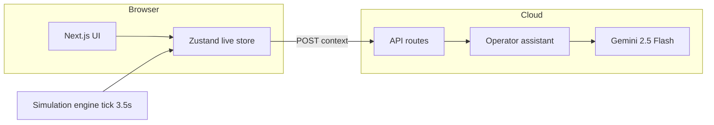

# StadiumOS AI — Judge Presentation Guide

**Presenter:** Suryanshu Nabheet  
**Event:** GDG Hackathon × Google Developer Groups  
**Venue scenario:** Narendra Modi Stadium, Motera, Ahmedabad — IPL-scale night match (132,000 capacity)  
**Live demo:** [https://stadiumos-1060302697447.europe-west1.run.app/](https://stadiumos-1060302697447.europe-west1.run.app/)  
**License:** MIT · **Stack:** Next.js 16, Gemini 2.5 Flash, Google Cloud Run  

> Use this document as your spoken script, slide outline, and live-demo checklist. Target **6–8 minutes** + Q&A.

---

## Slide 1 — Title (30 sec)

**StadiumOS AI**  
*Real-time stadium command intelligence for cricket at scale*

- Built by **Suryanshu Nabheet** for **GDG Hackathon**
- Co-brand: StadiumOS AI × Google Developer Groups
- Production on **Google Cloud Run** (europe-west1)

**Say:**  
“Good [morning/afternoon]. I’m Suryanshu Nabheet. StadiumOS AI is an integrated operations platform for large cricket venues — one live brain for crowd, security, and emergencies.”

---

## Slide 2 — The problem (1 min)

Use the exact pitch wording:

### The threat

Massive crowds at cricket matches create **dangerous bottlenecks**, **severe security vulnerabilities**, and **logistical chaos** during highly congested **pre- and post-match** movements.

### The gap

Current stadium operations rely on **fragmented, manual systems**, leaving security and volunteers **unable to adapt instantly** to:

- Rapid **crowd surges**
- Unpredictable **weather** shifts
- **Emerging threats**

### The need

Organizers urgently need an **integrated, real-time command platform** to:

- Unify **ticketing** context with operations
- **Dynamically route** crowd flow
- **Automate emergency** responses  

…for a **safe and seamless** fan experience.

**Say:**  
“Today, radios, spreadsheets, and siloed tools don’t share one picture. By the time someone reacts, a gate is already overloaded or an incident has escalated.”

---

## Slide 3 — Our solution (45 sec)

**StadiumOS AI** = one **live telemetry stream** powering six operator workspaces + a **Gemini assistant** that reads the same data.

| Pillar | What we deliver |
|--------|-----------------|
| **See** | Command center + circular digital twin |
| **Predict** | Crowd physics — gates, heatmap, stress index |
| **Act** | Emergency dispatch, reroutes, agent feed |
| **Ask** | Natural-language operator assistant |

**Say:**  
“We don’t replace ticketing systems — we give operators a single pane of glass that behaves like a real command center, with AI that only cites live numbers.”

---

## Slide 4 — Architecture (45 sec)



**Data flow (one sentence):**  
Browser simulation updates gates, stands, and incidents → every panel and the assistant use the **same snapshot**.

**Say:**  
“No fake static charts. One store ticks every 3.5 seconds. The assistant gets the identical JSON the dashboards see.”

---

## Slide 5 — Live demo script (3–4 min)

Open: **https://stadiumos-1060302697447.europe-west1.run.app/**

### Step 1 — Landing (20 sec)

- Show GDG banner, problem section, MIT license
- Click **Open command center**

### Step 2 — Command center `/dashboard` (60 sec)

Point out:

- **KPIs** — occupancy, gate wait, incidents, throughput (numbers changing)
- **Stadium map** — hero twin with gates, routes, incidents, heatmap
- **Emergency alerts** + **traffic** sidebar
- **Crowd stress** and **AI confidence** in header

**Say:**  
“This is match control. Everything you see is wired to one live simulation — Motera, 132,000 seats.”

### Step 3 — Crowd flow `/crowd-flow` (30 sec)

- Heatmap grid + congestion chart
- **Gate pressure** — 8 ingress points, wait times
- **AI reroute** suggestion (gate A → gate B)

**Say:**  
“When a gate crosses threshold, we suggest diversion before it becomes a stampede risk.”

### Step 4 — Emergency `/emergency` (45 sec)

Pick one incident card:

- **Incident report** → copies structured brief to clipboard
- **Dispatch** → advances status: detected → dispatching → responding
- Explain team names: **EMS Unit** (medical), **Rapid Response Squad** (crowd), **K9 & EOD Cell** (security / suspicious item)

**Say:**  
“Operators get one-click dispatch and a shareable report — not a separate radio chain.”

### Step 5 — Digital twin `/twin` (20 sec)

- Full circular schematic — stands, pitch, floodlights
- Live density % per sector

### Step 6 — AI Assistant `/assistant` (45 sec)

1. Type: **`hi`** → short greeting only (no data dump)
2. Type: **`Which gate is overloaded?`** → cites **real gate name and %** from live feed
3. Mention **Gemini 2.5 Flash** with local fallback if API unavailable

**Say:**  
“The assistant is grounded — we classify intent so ‘hello’ doesn’t trigger a ten-page brief.”

### Step 7 — Close demo (15 sec)

- Optional: `/analytics` — trends and evac readiness
- Return to landing or show health: `/api/health`

---

## Slide 6 — Tech & deployment (45 sec)

| Layer | Choice |
|-------|--------|
| Frontend | Next.js 16, React 19, Tailwind 4, shadcn UI |
| State | Zustand (live simulation) |
| Charts | Recharts |
| AI | Google Gemini 2.5 Flash (`@google/generative-ai`) |
| Deploy | Docker → **Cloud Run** (europe-west1) |
| CI/CD | Cloud Build from GitHub `main` |

**Production health check:**

```bash
curl https://stadiumos-1060302697447.europe-west1.run.app/api/health
```

**Say:**  
“Standalone Next.js build, containerized, deployed on GCP — same repo you can clone under MIT.”

---

## Slide 7 — Differentiators (30 sec)

1. **End-to-end product** — not a single chart or chatbot in isolation  
2. **Physics-linked simulation** — wait time and throughput correlate with gate density  
3. **Motera-faithful twin** — circular ground, real stand names, 8 gates  
4. **Assistant discipline** — intent-aware, anti-hallucination prompts  
5. **Production URL** — judges can try it on their phones  

---

## Slide 8 — Roadmap & honesty (20 sec)

**Demo / hackathon scope (today):**

- Simulated telemetry (Zustand), not a live BCCI feed
- Ticketing integration shown as **operational concept** in problem statement

**Production next steps:**

- Real sensor / CCTV / ticketing APIs
- Role-based access for operators
- PDF incident reports and audit logs

**Say:**  
“We’re honest: this is a high-fidelity operations simulator plus real AI and deploy — designed to show how the full system would behave on match day.”

---

## Slide 9 — Closing (20 sec)

**StadiumOS AI** — integrated crowd intelligence and emergency response for cricket at scale.

- **Live:** [stadiumos-1060302697447.europe-west1.run.app](https://stadiumos-1060302697447.europe-west1.run.app/)
- **GitHub:** [Suryanshu-Nabheet/StadiumOS](https://github.com/Suryanshu-Nabheet/StadiumOS)
- **License:** MIT

**Say:**  
“Thank you. I’m happy to take questions or hand you the link to explore the command center live.”

---

## Quick reference — Module URLs

| Module | URL |
|--------|-----|
| Landing | https://stadiumos-1060302697447.europe-west1.run.app/ |
| Command center | https://stadiumos-1060302697447.europe-west1.run.app/dashboard |
| Crowd flow | https://stadiumos-1060302697447.europe-west1.run.app/crowd-flow |
| Emergency | https://stadiumos-1060302697447.europe-west1.run.app/emergency |
| Digital twin | https://stadiumos-1060302697447.europe-west1.run.app/twin |
| Analytics | https://stadiumos-1060302697447.europe-west1.run.app/analytics |
| AI Assistant | https://stadiumos-1060302697447.europe-west1.run.app/assistant |

---

## Q&A — Likely judge questions

**Q: Is the data real?**  
A: Live **simulation** with realistic physics and Motera layout. Architecture supports plugging real APIs; same store and APIs would consume them.

**Q: How is this different from a dashboard + ChatGPT?**  
A: One shared telemetry model across six modules; assistant receives structured context and intent limits; dispatch, map, and reroutes are **actions**, not chat-only.

**Q: What does “dispatch” do?**  
A: Advances incident workflow and timeline; represents sending **Gujarat EMS**, **Rapid Response Squad**, **K9 & EOD Cell**, etc.

**Q: What is EOD?**  
A: Explosive Ordnance Disposal — used in our suspicious-package scenario with K9.

**Q: Why Google Cloud?**  
A: Cloud Run for serverless deploy, Gemini for the operator brain, fits GDG / Google ecosystem.

**Q: Can it scale to World Cup?**  
A: Designed for 132k-seat geometry; architecture is stateless API + client simulation; scale-out on Cloud Run.

**Q: Open source?**  
A: Yes — **MIT License**, copyright Suryanshu Nabheet.

---

## Emergency glossary (if asked on stage)

| Term | In StadiumOS |
|------|----------------|
| **Incident report** | Clipboard text summary of one incident |
| **Dispatch** | Confirm team en route; update status & ETA |
| **EMS Unit** | Medical response team label |
| **Rapid Response Squad** | Crowd / ingress surge team |
| **K9 & EOD Cell** | Security + bomb-disposal scenario |
| **Security checkpoints** | Map markers at screening points |
| **Agent feed** | Autonomous AI actions (CrowdFlow, Security, Traffic, Weather) |

---

## Pre-presentation checklist

- [ ] Open production URL on laptop + phone (backup network)
- [ ] Confirm `/api/health` returns `gemini: true` if demonstrating AI
- [ ] Start on **Command center** tab ready; simulation running ~30 sec before pitch
- [ ] Close unrelated tabs; full-screen browser
- [ ] Prepare `hi` and `Which gate is overloaded?` in assistant beforehand
- [ ] GitHub repo public; README has live link

---

## Timing cheat sheet

| Section | Minutes |
|---------|---------|
| Intro + problem | 1.5 |
| Solution + architecture | 1.5 |
| Live demo | 3.5 |
| Tech + differentiators + close | 1.5 |
| **Total** | **~8** |

---

*Good luck at GDG Hackathon — StadiumOS AI × Google Developer Groups*
